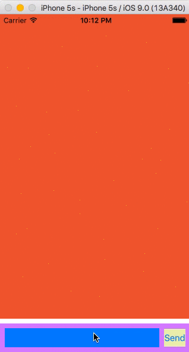

# KBTextView
A sub class of UIView that contains a UITextView and a UIButton that moves according to keyboard show/hide/frame change. This arrangement is mostly used in chat applications.

# Screenshots

# Installation instructions

1. Just copy "ContentView.h" and "ContentView.m" files in your project.

2. Connect the required NSLayoutConstraints and IBOutlets as shown in the ViewController.m and intialise the ContentView class.

#Info

Tested in iOS 7.1 and above but not iOS 9

#Points to note

1. You can make the ViewController the delegate of UITextView (currently the delegate is ContentView).
2. If you programmatically change the text of UITextView and its delegate method does not get called, you may have to call it manually.